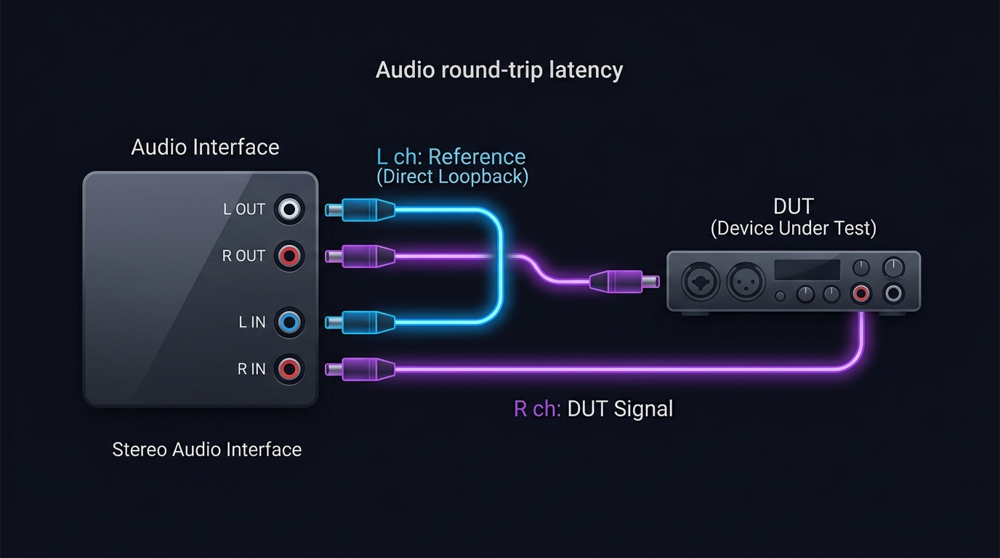

# Dual-Channel RTL Analyzer

> **Audio Equipment Round-Trip Latency (RTL) Automated Measurement Tool**  
> **オーディオ機器単体 処理レイテンシー自動測定デスクトップアプリケーション**

[](https://www.python.org/)
[](https://www.qt.io/)
[](LICENSE)
[](https://www.isamutheguitar.com)

Developed by **[ISAMU the Guitar](https://www.isamutheguitar.com)**  
GitHub Repository: [https://github.com/isamutheguitar/RTL-Analyzer](https://github.com/isamutheguitar/RTL-Analyzer)

---

## English Section

### Overview

**Dual-Channel RTL Analyzer** is a native GUI desktop application designed for audio engineers, gear reviewers, and DSP researchers to automatically measure the pure processing latency (Round-Trip Latency / RTL) of hardware audio equipment with sub-millisecond precision.

By using a **Gaussian impulse test signal** sent simultaneously to a direct loop-back reference channel (L ch) and a Device Under Test channel (R ch), the application detects onset timing on both channels to calculate latency while canceling out pulse rise-time systematic errors (~0.5 ms).

### Key Features

- **Dual-Channel Onset Detection**: Uses Gaussian impulse onset detection on both L and R channels to eliminate systematic pulse rise-time bias.
- **Configurable Noise Threshold (Trigger Ratio)**: Adjustable noise multiplier (`Auto` = x1, `x2`, `x4`, `x8`) to handle quiet studio gear as well as noisy analog/DSP chains.
- **Dynamic Waveform Visualization**: Matplotlib plot embedded in PySide6 with adjustable time axis scaling (`x1`, `x2`, `x4`) anchored to the reference onset ($t = 0.0\text{ ms}$).
- **Level Calibration (Level Check)**: 1 kHz test tone at −12 dBFS to verify hardware input levels before starting measurement.
- **Exporting Capabilities**:
  - Export statistical results and per-trial latency data to **CSV**.
  - Save high-resolution **PNG waveform images**.
- **Automated Specification PDF Generator**: Includes a Python script (`generate_spec_pdf.py`) to generate a complete dark-themed PDF manual in English and Japanese.
- **Standalone Binary Build**: Pre-configured `build.bat` for PyInstaller single-file `.exe` compilation.

---

### Hardware Connection Setup

Connect your 2-in / 2-out (or multi-channel) audio interface as follows:



1. **L Channel (Reference)**: Connect **Audio Interface L OUT → L IN** directly using a short cable (Loop-back).
2. **R Channel (DUT)**: Connect **Audio Interface R OUT → DUT Input**, and **DUT Output → R IN**.

---

### Requirements & Installation

#### System Requirements
- **OS**: Windows 10 / 11 (64-bit), macOS, or Linux
- **Python**: 3.10 or later
- **Audio Interface**: Stereo audio interface with ASIO (recommended) or WDM/MME drivers.

#### Installation

1. **Clone the repository**:
   ```bash
   git clone https://github.com/isamutheguitar/RTL-Analyzer.git
   cd RTL-Analyzer
   ```

2. **Install required dependencies**:
   ```bash
   pip install -r requirements.txt
   ```

3. **Run the application**:
   ```bash
   python main.py
   ```

---

### Standalone Executable Build (`.exe`)

To compile the application into a single executable file for Windows:

```cmd
build.bat
```

The output file will be generated in `dist/RTL_Analyzer.exe`.

---

### Specification PDF Generation

To generate the full PDF manual (`RTL_Analyzer_Specification.pdf`):

```bash
python generate_spec_pdf.py
```

The PDF will be saved to your `~/Downloads` directory.

---

<br/>

---

## 日本語セクション（Japanese Section）

### 概要

**Dual-Channel RTL Analyzer** は、オーディオ機器単体（エフェクター、DSPユニット、ミキサー、アンプシミュレーター等）の純粋な**処理レイテンシー（Round-Trip Latency / RTL）**をサブミリ秒精度で自動測定するネイティブGUIデスクトップアプリケーションです。

Lチャンネル（直結ループバック＝基準信号）とRチャンネル（DUT経由＝測定信号）に**ガウシアンインパルス信号**を同時に送出し、両チャンネルのオンセット（立ち上がり）を検出して時間差を算出します。両チャンネルともにオンセット検出を採用することで、インパルス立ち上がりによる系統誤差（約0.5 ms）を相殺し、極めて高い精度を実現しています。

---

### 主な機能と特徴

- **両チャンネル・オンセット検出**: L/R両チャンネルにオンセット検出（立ち上がり位置特定）を適用し、インパルスのパルス幅（約0.5 ms）による測定偏位を完璧に相殺。
- **トリガー条件選択（ノイズ倍率設定）**: ノイズフロアに対する検出閾値を `Auto`（6.0倍）、`x2`（12.0倍）、`x4`（24.0倍）、`x8`（48.0倍）から選択可能。ローノイズなスタジオ機材からハイノイズなアナログ機材まで柔軟に対応。
- **波形プロット時間軸拡大（x1 / x2 / x4）**: 基準波形のトリガー位置（L onset = $0.0\text{ ms}$、画面左から20%の位置）を固定したまま、時間軸の表示スパンを `x1`（デフォルト）、`x2`（2倍）、`x4`（4倍）にリアルタイムで拡大表示。
- **レベルチェック機能**: −12 dBFS / 1 kHz サイン波を500 ms再生し、入力ゲインや出力レベルが適正範囲（−36 dBFS ～ −1 dBFS）にあるかを事前確認。
- **測定結果・波形のエクスポート**:
  - 全試行データおよび平均・最大・最小・標準偏差の統計結果を **CSV** ファイルへ保存。
  - プロット波形を **PNG** 画像として高解像度保存。
- **PDF仕様書自動生成機能**: `generate_spec_pdf.py` を実行することで、日英併記のダークテーマ仕様書PDFを自動生成。
- **ワンクリック単一exe化**: PyInstallerを用いた `build.bat` を同梱。

---

### ハードウェア接続方法

2 in / 2 out（またはそれ以上）のオーディオインターフェースを以下のように接続してください。


1. **L チャンネル（基準 / Reference）**: オーディオインターフェースの **L OUT → L IN** を短いケーブルで直接接続します（ループバック）。
2. **R チャンネル（測定対象 / DUT）**: オーディオインターフェースの **R OUT → 測定対象機材(DUT)の入力**、**DUTの出力 → R IN** へ接続します。

---

### 使用手順・動作環境

#### 動作環境
- **OS**: Windows 10 / 11 (64-bit), macOS, Linux
- **Python**: 3.10 以上
- **オーディオインターフェース**: ステレオ対応、ASIOドライバー推奨（WDM/MMEにも対応）

#### 起動手順

1. **リポジトリのクローン**:
   ```bash
   git clone https://github.com/isamutheguitar/RTL-Analyzer.git
   cd RTL-Analyzer
   ```

2. **依存パッケージのインストール**:
   ```bash
   pip install -r requirements.txt
   ```

3. **アプリケーションの起動**:
   ```bash
   python main.py
   ```

---

### 1ファイルexeのビルド方法 (`build.bat`)

Windows環境で単一の実行可能ファイル（`.exe`）を作成する場合：

```cmd
build.bat
```

ビルド成果物は `dist/RTL_Analyzer.exe` に生成されます。

---

### 仕様書PDFの生成方法

本ツールの仕様書・測定アルゴリズム解説PDF（`RTL_Analyzer_Specification.pdf`）を生成する場合：

```bash
python generate_spec_pdf.py
```

生成されたPDFは `~/Downloads` フォルダに保存されます。

---

## Author / 著者

**ISAMU the Guitar**
- Website: [https://www.isamutheguitar.com](https://www.isamutheguitar.com)
- GitHub: [@isamutheguitar](https://github.com/isamutheguitar)

---

## License

This project is licensed under the [MIT License](LICENSE).
